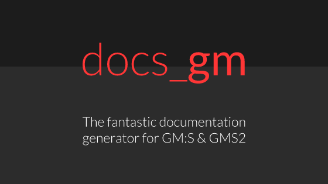
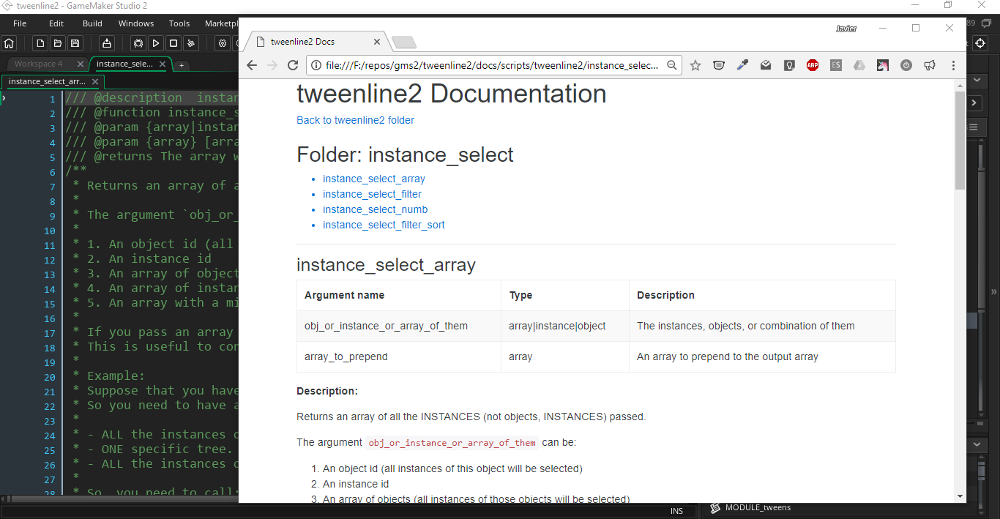

# docs_gm

[](https://gitter.im/docs_gm/Lobby?utm_source=badge&utm_medium=badge&utm_campaign=pr-badge&utm_content=badge)
[](https://greenkeeper.io/)
[](https://www.npmjs.com/package/docs_gm)
[](https://www.npmjs.com/package/docs_gm)
[](https://travis-ci.org/jhm-ciberman/docs_gm)
[](https://coveralls.io/github/jhm-ciberman/docs_gm?branch=master)
[](https://codeclimate.com/github/jhm-ciberman/docs_gm/maintainability)

> The fantastic documentation generator for GameMaker:Studio and GameMaker Studio 2



## ✅ Features

- Supports both GMS1 and GMS2 projects.
- It's Multiplatform! Windows, OSX and Linux supported.
- Easily customizable template engine.
- OnePage and Multipage documentations.
- Supports a lot of JSDoc tags!
- Markdown supported!
- Reports when some scripts are bad documented, or lack documentation.



## ☁️ Installation

Install [Node JS from the official website](https://nodejs.org/).
Then open the windows console and install it with the following command:

```bash
npm install -g docs_gm
```

To view the HELP of docs_gm run:

```bash
docs_gm --help
```

You can also see the help for some specific command:

```bash
docs_gm generate --help
```

----------

## ❓ How to use it

### > First: Document your project

You will need to document your scripts following JSDoc syntax. You can learn more about in the [official JSDoc website](http://usejsdoc.org/)

For example:  In the script `my_script`

```js
/// my_script(coffee_type, cakes_number [, clean_after_work]);
/**
 * This script will do a lot of things. Like make
 * coffee, and bake a cake. It will return the
 * index of the generated breakfast.
 *
 * @param {string} coffee_type - The type of coffee
 * you want
 * @param {integer} cakes_number - The number of cakes
 * to bake.
 * @param {boolean} [clean_after_work] - Specify if the
 * table must be cleaned after the baking process.
 * The default is true.
 *
 * @returns {Breakfast} The index of the generated
 * breakfast.
 */

if (argument[0] === "latte") {
   // your code here...
   // blah blah blah
   // more code
}
return foo;
```

docs_gm supports both `/// triple slash comments` and `/** JSDoc single line and multiline comments */`

The following JSDoc tags are supported by gm_docs:

- [`@description`, `@desc`, and inline description (like the above example)](http://usejsdoc.org/tags-description.html)
- [`@param`, `@arg`, `@argument`](http://usejsdoc.org/tags-param.html)
- [`@returns`, `@return`](http://usejsdoc.org/tags-returns.html)
- [`@private`](http://usejsdoc.org/tags-private.html)
- [`@function`, `@func`, `@method`](http://usejsdoc.org/tags-function.html)
- [`@example`](http://usejsdoc.org/tags-example.html)
- More tags will be supported in the next updates

### > Second: Run gm_docs from the command line

Navigate to the directory you have your GameMaker project. For example, for GameMaker:

```bash
cd C:\Users\YOUR_USER\Documents\GameMaker\Projects\my-project-name
```

or for GameMaker:Studio 2 (windows)

```bash
cd C:\Users\YOUR_USER\Documents\GameMakerStudio2\my-project-name
```

To GENERATE the documentation for the current project run:

```bash
docs_gm generate
```

If you want to change the default (Ugly) configuration run the following command and follow the instructions on the screen to add the configuration file to your project.

```bash
docs_gm init
```

You must follow the instructions that appears on the console and then you can edit the configuration file with any text editor and re-run `docs_gm generate`.

You can also override some specific configuration using the arguments on the console. For example, to change the design to use:

```bash
docs_gm generate --design myDesignName
```

## Changing the template and design

Each **template** can have multiple **designs**.

`docs_gm` includes [one integrated default template](https://github.com/jhm-ciberman/docs_gm-basic) (called `docs_gm-basic`).
That template includes four possible designs:

- `onepage`: (The default design) Shows all the project scripts in one single HTML pages with a table of contents. It does not shows the folder structure. Ideal for smaller projects.
- `multipage`: Each script documentation is generated in a separate HTML file, and the index file contains a table of contents with links to each script page. It does not shows the project folder structure. Ideal for medium sizes projects.
- `modules-onepage`: Each script and each folder is generated in a separate HTML file. Each folder shows the folder children with the documentation of each script on the same page. It shows the folder structure. Ideal for big sized projects.
- `modules-multipage`: Each script and each folder is generated in a separate HTML file. Each folder shows the folder children with links to each one and to his parent folder. It shows the folder structure, but it requires more clicks to reach an specific script documentation. Ideal for huge sized projects.

For example, if you want to change the **design**, you can change the `design` value in your configuration file (See `docs_gm init`) to the design name you want to use. For example:

```json
"design": "multipage",
```

You can also change the name of the template to use (the template package must be installed globally). For example, if you have a template named `docs_gm-awesome-template`, you can write this in your configuration file:

```json
"template": "awesome-template",
```

Another alternative is to set the values using the console:

```bash
docs_gm generate --design multipage --template awesome-template
```

Check the help for the `generate` command with `docs_gm generate --help` to see all the possible values that can be overwritten in the console.

## Custom templates

You can create custom HTML templates and use them with docs_gm. Refer to [this page](./custom_templates.md) for how to create a custom template.

## Folder scoped documentation

If you want to add documentation for one folder containing multiple scripts, you can create a GameMaker script called: `FOLDER_anyname` or `MODULE_anyname` inside your folder and add a simple JSDoc comment inside that script with the documentation for your module. You can use [markdown](https://github.com/adam-p/markdown-here/wiki/Markdown-Cheatsheet). 

For example:

```text
+ scripts [root folder]
  + inventory_system [folder]
    - FOLDER_inventory_system [script]
    - inventory_add_item [script]
    - inventory_get_item [script]
    - inventory_draw [script]
```

Inside FOLDER_inventory_system script you can write something like this:

```js
/**
 * Inventory System
 * ================
 *
 * > By Javier "Ciberman" Mora
 *
 * You can use this functions to create your inventory
 * and you need to... bla bla bla...
 * More documentation **with markup** here.
 *
 * - You can create bullets
 * - with items
 *
 * And also add [links](http://google.com).
 */
```

Then you can use any template with a design that supports modules. (For example the `docs_gm-basic` Template has `modules-onepage` and `modules-multipage` designs.)

> Note: you can create multiple subfolders and document each one with one `MODULE_` or `FOLDER_` script inside each subfolder.

## Contribute

I would love to see people interested in contributing to docs_gm. If you have some idea, or bug, you can send a Issue in the github page. Also, you can check the [contribute document](CONTRIBUTE.md)

## Contributors

- Javier "Ciberman" Mora ([@jhm-ciberman](https://github.com/jhm-ciberman/)) Maintainer
- Peter Hagen ([@phgn0](https://github.com/phgn0))
