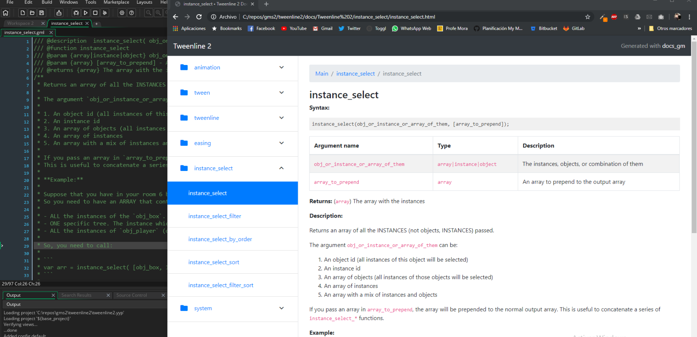

# docs_gm

> The fantastic documentation generator for GameMaker:Studio and GameMaker Studio 2

## ✅ Features

- Supports both GMS1 and GMS2 projects.
- It's Multiplatform! Windows, OSX and Linux supported.
- Easily customizable template engine.
- OnePage and Multipage documentations.
- Supports a lot of JSDoc tags!
- Markdown supported!
- Reports when some scripts are bad documented, or lack documentation.

## Contribute

I would love to see people interested in contributing to docs_gm. If you have some idea, or bug, you can send a Issue in the github page. Also, you can check the [contribute document](wiki/Contribute)

## Contributors

- Javier "Ciberman" Mora ([@jhm-ciberman](https://github.com/jhm-ciberman/)) Maintainer
- Peter Hagen ([@phgn0](https://github.com/phgn0))
